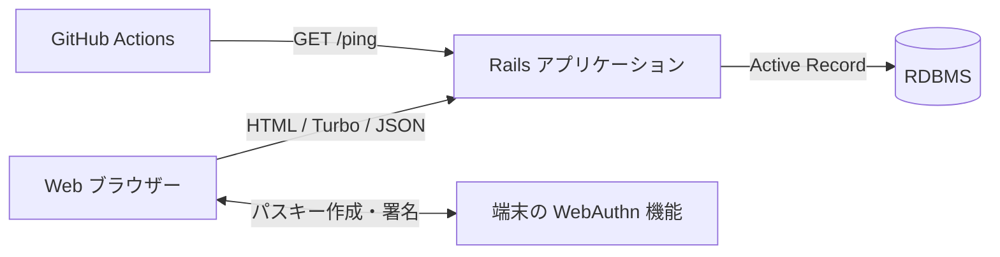

# システム概要

## 1. 目的と範囲

### 実装事実

cook_app は、利用者ごとに献立、料理、食材、買い物項目、過去の料理、人物タグを管理する Rails アプリケーションである。献立に登録した食材を買い物リストへ同期し、日付を過ぎた献立を過去料理として履歴化して、元の献立を移行済みにする処理を持つ。一般利用者向け機能に加え、管理者向けの参照・ユーザー削除画面がある。

主な根拠:

- route 全体: `config/routes.rb:1-70` (`Rails.application.routes.draw`)
- 献立作成と買い物同期: `MealPlansController#create`, `#save_meal_plan!`（`app/controllers/meal_plans_controller.rb`）
- 過去献立の履歴化: `app/controllers/application_controller.rb:30-56` (`ApplicationController#migrate_past_meal_plans!`)
- 管理者認可: `app/controllers/admin/base_controller.rb:1-5` (`Admin::BaseController`)

### 対象外または実機能なし

このリポジトリには Rails の基底クラスとして Job、Mailer、Action Cable が存在するが、業務処理を行う具象クラスは確認できない。

- `app/jobs/application_job.rb:1-7`
- `app/mailers/application_mailer.rb:1-4`
- `app/channels/application_cable/channel.rb:1-4`
- `app/channels/application_cable/connection.rb:1-4`

## 2. 技術構成

| 分類 | 現行構成 | 根拠 |
|---|---|---|
| 言語 | Ruby 3.2.0 | `.ruby-version:1`, `Gemfile:3` |
| Web フレームワーク | Ruby on Rails 7.1 系 | `Gemfile:6`, `config/application.rb:10-17` |
| テンプレート | ERB | `app/views/**/*.html.erb` |
| 画面更新 | Turbo + Stimulus | `Gemfile:17-21`, `app/javascript/application.js:1-3` |
| JavaScript 配布 | importmap | `Gemfile:14-15`, `config/importmap.rb:1-7` |
| 通常認証 | Rails session + `has_secure_password` | `app/controllers/application_controller.rb:6-18`, `app/models/user.rb:1-4` |
| パスキー | WebAuthn | `Gemfile:37-38`, `app/controllers/passkey_sessions_controller.rb:4-43` |
| 開発・テスト DB | MySQL | `Gemfile:46-49`, `config/database.yml:12-29` |
| 本番 DB | `DATABASE_URL` を使う構成、Gem は PostgreSQL | `Gemfile:51-54`, `config/database.yml:51-54` |
| Web サーバー | Puma | `Gemfile:11-12`, `config/puma.rb:10-44` |
| タイムゾーン・locale | Tokyo、日本語 | `config/application.rb:24-26` |

DB adapter の環境差には未確認の互換性リスクがある。確定事項と drift は [07-drift-risks-open-questions.md](07-drift-risks-open-questions.md) を参照する。

## 3. システム境界

### 境界ごとの責務

| 境界 | アプリ側の責務 | 確認状況 |
|---|---|---|
| ブラウザー | ERB を返し、Turbo/Stimulus で献立 quick edit、買い物更新、WebAuthn を補助する | コード確認済み |
| DB | ユーザー単位のデータ、関連、unique/check/FK 制約を保持する | MySQL 形式の `db/schema.rb` を確認済み |
| WebAuthn | challenge を session に保持し、登録・ログイン結果を検証する | コードと options のテスト期待を確認。実端末は未確認 |
| GitHub Actions / Render | 定期的に公開 `/ping` を呼び出す | workflow 確認済み。外部サービスの現在状態は未確認 |
| メール・非同期 Job・Cable | 業務上の実処理は確認できない | 基底クラスのみ |

## 4. 主要ディレクトリ

| パス | 内容 | 変更時の注意 |
|---|---|---|
| `app/controllers/` | 認証、画面処理、transaction、検索、同期 | `current_user` scope と GET 時履歴化を確認する |
| `app/models/` | 関連、enum、validation、正規化、削除連鎖 | `db/schema.rb` の DB 制約と二重に確認する |
| `app/views/` | 一般・管理画面、Turbo Frame、フォーム | route、controller の instance variable、権限表示を確認する |
| `app/javascript/controllers/` | Stimulus controller | HTML の `data-*` 属性と対で変更する |
| `config/routes.rb` | 公開 route と管理 route | controller action、認証、テストを同時に確認する |
| `config/initializers/` | WebAuthn などの初期設定 | 値を文書へ転記せず、環境変数名だけを扱う |
| `db/migrate/` | スキーマ変更履歴 | 作成・実行には承認 Gate が必要 |
| `db/schema.rb` | 現在の schema dump | 現在は MySQL 方言。手編集しない |
| `test/integration/` | 画面・route・主要ユースケースの期待 | DB 接続不能時は未実行と明記する |
| `test/models/` | モデル制約の期待 | schema 制約との不一致も確認する |
| `.github/workflows/` | 定期 `/ping` | テスト CI ではない点に注意する |
| `docs/agent-reference/` | 本参照資料 | 実装変更と同時に更新する |

## 5. アプリケーション内の責務境界

### Controller

認証、ユーザー scope、parameter 整形、transaction、画面応答を担う。サービス層はなく、献立保存・買い物同期・履歴化などの業務処理も controller に置かれている。

- 献立作成時の保存: `MealPlansController#save_meal_plan!`（`app/controllers/meal_plans_controller.rb`）
- 献立通常編集の差分同期: `MealPlansController#sync_full_update!`, `#sync_dishes_for_full_update!`, `#sync_ingredients_for_full_update!`
- quick edit: `MealPlansController#quick_update`, `#sync_quick_ingredients!`
- 過去献立の履歴化: `app/controllers/application_controller.rb:30-56`

### Model

関連、validation、enum、入力正規化、削除連鎖を担う。

- User 集約: `app/models/user.rb:1-16`
- MealPlan 集約: `app/models/meal_plan.rb:1-16`
- ShoppingItem 整合性: `app/models/shopping_item.rb:1-44`

### View / JavaScript

ERB がフォームと画面構造を作り、Turbo と Stimulus が局所更新およびブラウザー API 連携を担う。バックエンド API 専用アプリではない。

### DB

unique index、foreign key、check constraint で一部の整合性を担保する。ただし `dependent: :destroy` は Rails 側の関連定義であり、DB の `ON DELETE CASCADE` と同義ではない。詳細は [03-architecture-and-data.md](03-architecture-and-data.md) を参照する。

## 6. 未確認事項

- 本番 PostgreSQL で migration、schema load、主要 SQL が正常に動作するか
- Docker image が本番用 `pg` gem と必要ライブラリを含めて build・起動できるか
- Render の現在の build/start command、DB、環境変数、監視設定
- 実端末でのパスキー登録・ログイン
- データ量増加時の controller 内同期処理と検索の性能
