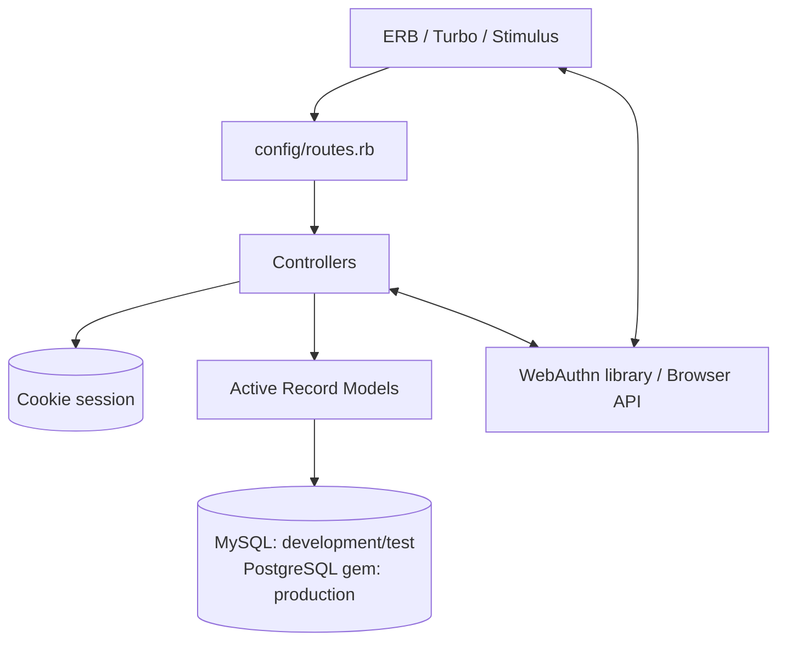
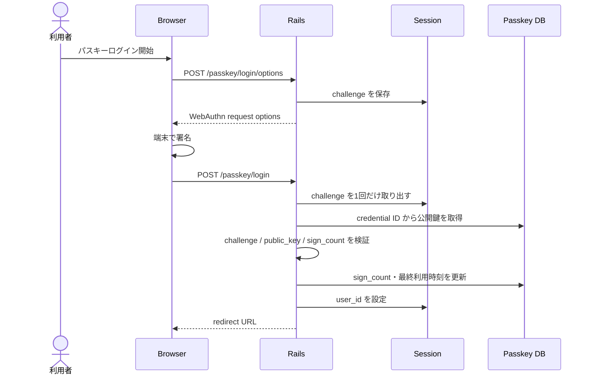
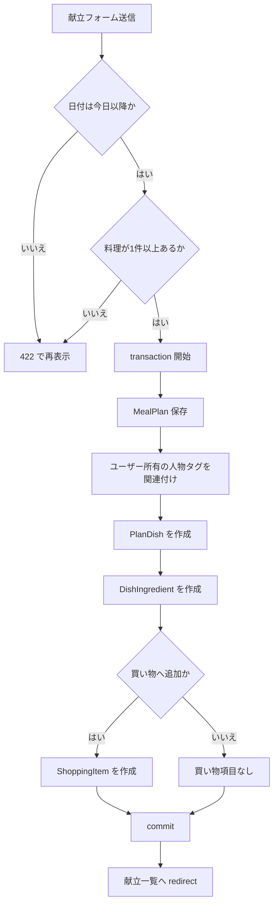
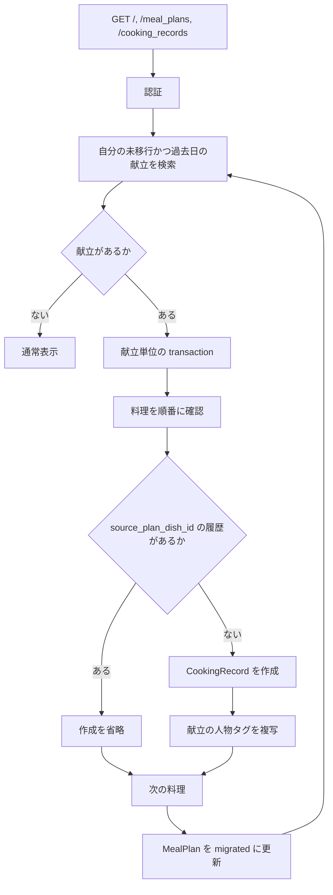

# アーキテクチャとデータ

## 1. アプリケーション構成

### 実装事実

cook_app は Rails の MVC 構成である。専用の service/repository 層はなく、主要な業務処理は controller と model に実装されている。



根拠:

- Rails 構成: `config/application.rb:1-28`
- route: `config/routes.rb:1-70`
- Turbo/Stimulus/importmap: `app/javascript/application.js:1-3`, `config/importmap.rb:1-7`
- DB adapter: `Gemfile:46-54`, `config/database.yml:12-29,51-54`

## 2. 認証と認可

### 2.1 通常 session 認証

1. `SessionsController#create` が正規化した email で `User` を検索する。
2. `has_secure_password` の `authenticate` が成功すると `session[:user_id]` を設定する。
3. `ApplicationController#current_user` が session の ID から User を取得する。
4. 認証必須 controller は `authenticate_user!` を実行する。
5. logout は `reset_session` する。

根拠: `app/models/user.rb:1-4,18-28`; `app/controllers/sessions_controller.rb:7-22`; `app/controllers/application_controller.rb:2-18`

### 2.2 パスキー認証



根拠: `app/controllers/passkey_sessions_controller.rb:4-53`; 登録は `app/controllers/passkey_registrations_controller.rb:4-58`; origin/RP 設定は `config/initializers/webauthn.rb:1-9`

### 2.3 管理者認可

- 管理 namespace の通常画面は、ログイン済みかつ `User#admin?` を必要とする。`app/controllers/admin/base_controller.rb:1-5`; `app/controllers/application_controller.rb:24-28`
- 管理者新規登録は `Admin::BaseController` を継承せず、固定 Basic 認証と未ログイン条件を使用する。認証値は本資料に記載しない。`app/controllers/admin/registrations_controller.rb:2-4`
- 一般ユーザー向けデータ操作は、原則 `current_user` の関連から対象を取得し、他ユーザー ID を 404 にする。例: `MealPlansController#set_meal_plan` (`app/controllers/meal_plans_controller.rb:124-126`)、`ShoppingItemsController#set_shopping_item` (`app/controllers/shopping_items_controller.rb:93-95`)

## 3. 主要処理フロー

### 3.1 献立作成と買い物同期



根拠: `app/controllers/meal_plans_controller.rb:16-45,146-148,236-266`

通常編集は同じ保存処理を `replace_existing: true` で呼び、既存の料理以下を全削除して再作成する。quick edit は別処理で ID 単位に同期する。詳細は [02-functional-specification.md](02-functional-specification.md#43-通常献立編集と-quick-edit-の違い) を参照する。

### 3.2 GET 時の過去献立履歴化



根拠: `app/controllers/application_controller.rb:30-56`; 呼び出し元 `app/controllers/home_controller.rb:2-3`, `app/controllers/meal_plans_controller.rb:2-3`, `app/controllers/cooking_records_controller.rb:2-3`

注意: 読み取りに見える GET が DB 書き込みを行う。監視、cache、再試行、読み取り専用 replica を検討するときはこの性質を考慮する。

## 4. ER 図

```mermaid
erDiagram
    USERS ||--o{ MEAL_PLANS : owns
    USERS ||--o{ SHOPPING_ITEMS : owns
    USERS ||--o{ COOKING_RECORDS : owns
    USERS ||--o{ PERSON_TAGS : owns
    USERS ||--o{ PASSKEYS : owns

    MEAL_PLANS ||--o{ PLAN_DISHES : contains
    PLAN_DISHES ||--o{ DISH_INGREDIENTS : contains
    DISH_INGREDIENTS o|--o{ SHOPPING_ITEMS : source

    MEAL_PLANS ||--o{ MEAL_PLAN_PERSON_TAGS : tagged_by
    PERSON_TAGS ||--o{ MEAL_PLAN_PERSON_TAGS : tags

    COOKING_RECORDS ||--o{ COOKING_RECORD_PERSON_TAGS : tagged_by
    PERSON_TAGS ||--o{ COOKING_RECORD_PERSON_TAGS : tags

    MEAL_PLANS o|--o{ COOKING_RECORDS : source_plan
    PLAN_DISHES o|--o| COOKING_RECORDS : source_dish

    USERS {
        bigint id PK
        string email UK
        string password_digest
        integer role
        string nickname
        string webauthn_id UK
    }
    MEAL_PLANS {
        bigint id PK
        bigint user_id FK
        date meal_date
        integer meal_type
        boolean migrated
        datetime migrated_at
    }
    PLAN_DISHES {
        bigint id PK
        bigint meal_plan_id FK
        string name
        text memo
        boolean eating_out
        integer position
    }
    DISH_INGREDIENTS {
        bigint id PK
        bigint plan_dish_id FK
        string name
        boolean add_to_shopping_list
    }
    SHOPPING_ITEMS {
        bigint id PK
        bigint user_id FK
        bigint dish_ingredient_id FK
        string name
        boolean manual
        boolean purchased
        datetime purchased_at
        integer sort_order
    }
    COOKING_RECORDS {
        bigint id PK
        bigint user_id FK
        bigint source_meal_plan_id FK
        bigint source_plan_dish_id FK_UK
        string name
        date cooked_on
        integer meal_type
        boolean eating_out
    }
    PERSON_TAGS {
        bigint id PK
        bigint user_id FK
        string name
        boolean default_selected
    }
    PASSKEYS {
        bigint id PK
        bigint user_id FK
        string external_id UK
        text public_key
        string nickname
        integer sign_count
        datetime last_used_at
    }
    MEAL_PLAN_PERSON_TAGS {
        bigint meal_plan_id FK
        bigint person_tag_id FK
    }
    COOKING_RECORD_PERSON_TAGS {
        bigint cooking_record_id FK
        bigint person_tag_id FK
    }
```

根拠: `db/schema.rb:13-186`

補足: `CookingRecord` の source 2項目は手動外食を許可するため nullable である。`db/schema.rb:26-48`; `db/migrate/20260523040100_allow_manual_cooking_records.rb:1-6`

## 5. モデル・制約

| モデル | 主な関連・制約 | 根拠 |
|---|---|---|
| `User` | role は member/admin。email 正規化・一意。password は6〜20文字の英数字混在。最後の admin は削除不可 | `app/models/user.rb:1-28,34-65`; `db/schema.rb:156-170` |
| `MealPlan` | user・日付・食事区分で一意。meal_type は lunch/dinner。migrated と migrated_at を整合 | `app/models/meal_plan.rb:1-23`; `db/schema.rb:73-87` |
| `PlanDish` | name 必須、position は0以上 | `app/models/plan_dish.rb:1-17`; `db/schema.rb:115-130` |
| `DishIngredient` | name 必須、前後空白を除去 | `app/models/dish_ingredient.rb:1-13`; `db/schema.rb:50-60` |
| `ShoppingItem` | name 必須。manual と食材参照、purchased と purchased_at を整合。sort_order は0以上 | `app/models/shopping_item.rb:1-44`; `db/schema.rb:132-154` |
| `CookingRecord` | name、日付、食事区分必須。元料理 ID は全体で一意、nullable | `app/models/cooking_record.rb:1-23`; `db/schema.rb:26-48` |
| `PersonTag` | user 内で名前一意。join model が同じ user の組み合わせを検証 | `app/models/person_tag.rb:1-16`; `app/models/meal_plan_person_tag.rb:1-16`; `app/models/cooking_record_person_tag.rb:1-16` |
| `Passkey` | external ID は一意。公開鍵・nickname 必須。sign_count は0以上 | `app/models/passkey.rb:1-15`; `db/schema.rb:89-100` |

### DB 制約

`db/schema.rb` には foreign key、unique index、および次の check constraint がある。

- user role と食事区分の値域
- 料理、食材、買い物項目、過去料理、人物タグの空白名禁止
- 献立の `migrated` / `migrated_at` 整合
- 買い物項目の `manual` / 食材参照整合
- 買い物項目の `purchased` / `purchased_at` 整合
- 料理 position の非負

根拠: `db/schema.rb:46-47,59,85-86,112,128-129,151-153,169`

## 6. 削除連鎖

以下は **Rails の `dependent: :destroy` による実装事実**である。

| 削除元 | Rails 経由で削除される主な関連 | 根拠 |
|---|---|---|
| `User` | 献立、買い物項目、過去料理、人物タグ、パスキー | `app/models/user.rb:6-10` |
| `MealPlan` | 料理、献立タグ join、source meal plan として紐づく過去料理 | `app/models/meal_plan.rb:4-8` |
| `PlanDish` | 食材、source dish として紐づく過去料理 | `app/models/plan_dish.rb:2-4` |
| `DishIngredient` | 紐づく買い物項目 | `app/models/dish_ingredient.rb:2-3` |
| `PersonTag` | 献立タグ join、過去料理タグ join | `app/models/person_tag.rb:2-6` |
| `CookingRecord` | 過去料理タグ join | `app/models/cooking_record.rb:4-8` |

### 重要な注意

- `db/schema.rb:172-185` の foreign key には `ON DELETE CASCADE` の指定が見当たらない。DB へ直接 DELETE する場合、Rails の削除連鎖と同じ結果になるとは限らない。
- 献立・料理を削除すると、それを source とする過去料理も Rails 関連により削除される。履歴保持要件を変更する場合は、関連定義と管理・一般の削除経路を同時に見直す。
- 通常献立編集は既存料理を `destroy_all` して再作成するため、関連食材と買い物項目も削除・再作成される。`app/controllers/meal_plans_controller.rb:236-265`
- 最後の管理者は `before_destroy` で削除を中止する。`app/models/user.rb:16,59-65`

## 7. transaction と冪等性

| 処理 | transaction | 冪等性・整合性 |
|---|---|---|
| 献立作成・通常編集 | あり | 失敗時は関連作成・全置換を rollback |
| quick edit | あり | 対象 ID を meal plan 内に scope。処理自体は同じ入力の再実行を想定した専用 API ではない |
| 過去献立の履歴化 | 献立単位であり | `source_plan_dish_id` の存在確認と unique index で重複を防ぐ |
| 過去料理 + 人物タグ保存 | あり | 保存失敗時に false を返して画面再表示 |
| 買い物 reorder | 全体 transaction なし | 各行を `update_all`。途中失敗時の一括 rollback はない |

根拠:

- `MealPlansController#save_meal_plan!`: `app/controllers/meal_plans_controller.rb:236-266`
- `MealPlansController#quick_update`: `app/controllers/meal_plans_controller.rb:100-122`
- `ApplicationController#migrate_past_meal_plans!`: `app/controllers/application_controller.rb:30-56`
- `CookingRecordsController#save_cooking_record_with_tags`: `app/controllers/cooking_records_controller.rb:132-140`
- `ShoppingItemsController#reorder`: `app/controllers/shopping_items_controller.rb:75-89`

## 8. リスク・未確認

- 現在の schema dump は MySQL 方言を含む一方、本番 bundle は PostgreSQL を使用する。migration/schema load の互換性は未確認。
- controller が業務処理を直接持つため、同一処理を新しい入口から再利用するときは transaction、認証 scope、副作用を取りこぼしやすい。
- GET 時履歴化は一般的な「GET は読み取り専用」という前提と異なる。
- WebAuthn の実端末検証、challenge の運用、有効 origin/RP ID の本番値は未確認。
- DB 直接操作時の削除動作は Rails の `dependent: :destroy` と異なる可能性がある。DB 操作は承認対象であり、AI が実行しない。
