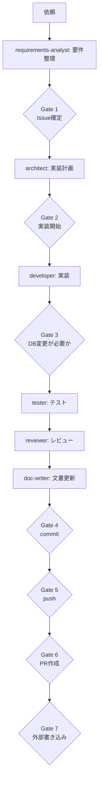

# AIエージェント作業ガイド

## 1. 目的

この文書は、本リポジトリでAIエージェントが安全かつ再現可能に作業するための役割分担、承認ゲート、タスク振り分けを定義する。コードの仕様説明は他の文書を参照し、この文書では作業プロセスを扱う。

正本は `$HOME/.codex/AGENTS.md` および `$HOME/.codex/claude-ai-team/docs/workflow.md` である。この文書と正本が食い違う場合は正本を優先する。

## 2. 基本原則

判断の優先順位は次のとおり。

1. 安全性
2. 正確性
3. 確定した要件・Issue
4. 各役職の責務
5. 指定された成果物形式
6. プロジェクトルール
7. キャラクター性

作業は「調査」「計画」「実装」「検証」を一度に進めず、各フェーズの終端で停止する。これを **最大歩幅1** と呼ぶ。軽い相槌や感想は承認ではなく、「Issueをこの内容で確定して」「この計画で実装して」のような具体的指示だけを進行許可として扱う。

## 3. 役割と書き込み境界

| 役割 | 主な責務 | 書き込み権限 |
|---|---|---|
| 高咲侑（オーケストレーター） | 依頼分類、担当割当、進捗・承認ゲート管理、成果物統合 | 専門作業は各担当へ委譲 |
| requirements-analyst | 要件整理、Issue案、受け入れ条件、対象外、未決事項 | read-only |
| architect | 影響調査、実装計画、変更ファイル、リスク、テスト戦略 | read-only |
| developer | 承認済みIssueと計画に基づくアプリ・テスト実装 | アプリコード・テスト |
| tester | テストケース作成、検証実行、実測結果と証跡 | read-only（検証コマンドのみ） |
| reviewer | Issue・計画・差分・テスト結果の横断レビュー | read-only |
| doc-writer | 設計書、定義書、運用手順、drift一覧 | `docs/` 配下のみ |

実装を変更できるのは developer だけである。tester、reviewer、doc-writerは問題を見つけても自分でアプリコードを直さず、根拠とともに次の担当へ引き渡す。

## 4. 標準フローと承認ゲート



| Gate | 人間が承認する内容 | AIの停止条件 |
|---|---|---|
| 1 | Issueの要件、範囲、対象外、受け入れ条件 | Issue確定前に計画へ進まない |
| 2 | 実装計画、変更ファイル、テスト、リスク | 承認前にコードを書かない |
| 3 | migration、DB変更、DB更新 | 承認前に実行しない |
| 4 | 実装・テスト・レビュー・文書を含む最終差分 | 承認前にcommitしない |
| 5 | push対象ブランチ・remote | **AIはpushを実行しない。人間が手動実行する** |
| 6 | PRのbase/head・本文・公開範囲 | **AIはPRを作成しない。人間が手動実行する** |
| 7 | DB以外の外部書き込み（メール、外部API、S3/SFTP等） | 宛先・内容・影響の承認前に実行しない |

Gate 5とGate 6では、AIは安全なコマンド案とPR本文案までを作成できるが、`git push` とPR作成コマンドは実行しない。

## 5. タスク別ルーティング

| 依頼内容 | 最初の担当 | 次の標準担当 |
|---|---|---|
| 曖昧な要望、仕様追加、バグ修正要望 | requirements-analyst | reviewer → Gate 1 |
| 確定Issueの実現方法を考える | architect | reviewer → Gate 2 |
| 承認済みIssue・計画を実装する | developer | tester → reviewer |
| テスト観点作成・テスト実行 | tester | reviewerまたはdeveloperへ結果共有 |
| 差分の品質・要件適合性を確認する | reviewer | 指摘があればdeveloper、なければdoc-writer |
| 設計書・運用手順・drift一覧を更新する | doc-writer | オーケストレーターへ統合報告 |
| commitする | `make-commit` 手順 | Gate 4後、明示パスのみ |
| push / PRを準備する | `propose-push-pr` 手順 | 人間による手動実行 |

診断依頼は、原因と根拠を報告するところまでであり、修正依頼を兼ねるとは限らない。修正が必要なら、確定Issueと実装開始承認を経る。

## 6. 安全ガード

### 6.1 secrets

- `.env`、秘密鍵、credentials復号情報、token、passwordを読まない。
- secretsの値をプロンプト、ログ、Issue、設計書、コミットへ転記しない。
- 固定値がコードに見つかっても、値そのものを報告せず「固定値が存在する」と位置だけを示す。

### 6.2 データベース

- DBは原則SELECTのみ。
- `db:drop`、`db:create`、未承認の`db:migrate`を実行しない。
- migrationやデータ更新が必要ならGate 3で停止する。
- connection先が不明な状態でconsole、runner、SQLを実行しない。

### 6.3 Git

- 既存のユーザー変更を消さない。
- `git add -A`、`git add .`、`git commit -a`を使わず、承認された明示パスだけをcommit対象にする。
- `git reset --hard`等の破壊的操作を独断で実行しない。
- AIはpush・PR作成を実行しない。

### 6.4 外部書き込み

- メール送信、外部API更新、S3/SFTPの削除・上書きはGate 7の対象とする。
- 承認は対象、宛先、内容、環境を具体的に確認する。
- ローカル変更の承認を外部書き込みの承認へ拡大解釈しない。

## 7. 各担当の引き渡し形式

各担当は次の見出しで、事実と未確認を分けて報告する。

```markdown
# 作業概要
# 入力として確認したもの
# 確認できた事実
# 判断・提案
# 成果物
# 次の担当者に確認してほしいこと
# 未確認事項
# 人間の承認が必要な項目
```

重要な判断にはIssue、対象ファイル・クラス・メソッド、schema・migration、テストコマンドと実測結果を付ける。未実施の確認を成功と報告しない。

## 8. 作業開始時の最短チェック

1. 依頼は「調査」「計画」「実装」「検証」「文書」のどれか。
2. 確定Issueと直前Gateの承認はあるか。
3. 自分の役割に書き込み権があるか。
4. secrets、DB、外部サービス、Git公開操作を含むか。
5. 既存の未コミット変更と競合しないか。
6. 終了時に、変更ファイル・検証結果・未確認・次のGateを報告できるか。
