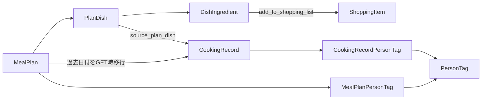

# 変更影響マップ

## 1. 使い方

この文書は、機能変更時に最初に読むべき最小のコード範囲と、関連テスト・波及先を示す。実装前には対象Issueに合わせて再調査し、この表だけで影響範囲を確定しない。

- **主要コード**: 最初に読むべき入口
- **影響先**: 変更で壊れやすい関連領域
- **テスト候補**: 既存テストの入口。2026-07-26にはRails test全86件と通常編集のSystem test 4件が成功しているが、変更時は対象差分に合わせて再実行する

## 2. 機能別マップ

| 機能 | 主要コード | 影響先 | テスト候補 |
|---|---|---|---|
| 通常ログイン・ログアウト | `app/controllers/sessions_controller.rb:1-22`、`app/models/user.rb:1-28` | session、未ログイン制御、member/admin共通入口 | `test/integration/authentication_flow_test.rb`、`test/models/user_test.rb` |
| ユーザー登録・プロフィール | `app/controllers/users_controller.rb`、`app/controllers/profiles_controller.rb`、`app/models/user.rb:18-28` | email一意性、nickname、password | `test/integration/authentication_flow_test.rb`、`test/integration/profiles_test.rb` |
| パスキー登録 | `app/controllers/passkey_registrations_controller.rb:4-43`、`app/models/passkey.rb:1-9` | WebAuthn challenge、credential保存、settings画面 | `test/integration/passkeys_test.rb`、`test/models/passkey_test.rb` |
| パスキーログイン | `app/controllers/passkey_sessions_controller.rb:4-42` | session、sign_count、last_used_at、通常ログイン画面 | `test/integration/passkeys_test.rb` |
| member/admin権限 | `app/controllers/application_controller.rb:14-28`、`app/controllers/admin/base_controller.rb:1-5`、`app/models/user.rb:4` | 全認証必須画面、admin namespace | `test/integration/admin_management_test.rb`、`test/integration/authentication_flow_test.rb` |
| 献立一覧・作成 | `MealPlansController#index`, `#create`, `#prepare_index_state`, `#save_meal_plan!` | PlanDish、DishIngredient、ShoppingItem、PersonTag | `test/integration/meal_plans_test.rb`、`test/models/meal_plan_test.rb`、`test/integration/shopping_items_test.rb` |
| 献立の通常編集 | `MealPlansController#update`, `#sync_full_update!`, `#validate_full_update_ids!`, `#sync_dishes_for_full_update!`, `#sync_ingredients_for_full_update!`、`app/views/meal_plans/edit.html.erb` | active/owner scope、nested ID、未変更ID・timestamp、料理位置、ShoppingItem、PersonTag join、CookingRecord、削除UI | `test/integration/meal_plans_test.rb`、`test/system/meal_plan_edit_test.rb`、`test/integration/shopping_items_test.rb` |
| 献立のquick edit | `MealPlansController#quick_update`, `#sync_quick_ingredients!`, `#sync_shopping_item_for_quick_ingredient!` | 個別DishIngredient、ShoppingItem同期、Turbo Stream | `test/integration/meal_plans_test.rb`、`test/integration/shopping_items_test.rb` |
| 料理並び替え | `MealPlansController#move_dish` | 現在はstub。PlanDish.positionの実動作なし | 追加テストが必要 |
| 買い物項目の自動生成・通常編集同期 | `MealPlansController#create_shopping_item_for_full_ingredient!`, `#sync_existing_full_ingredient!`, `#destroy_shopping_items_for_full_ingredient!`、`app/models/shopping_item.rb:1-12` | 食材のadd_to_shopping_list、名称、購入状態、sort_order、manual/source整合 | `test/integration/meal_plans_test.rb`、`test/integration/shopping_items_test.rb` |
| 手動買い物項目 | `app/controllers/shopping_items_controller.rb:16-17` | manual=true、dish_ingredientなし、並び順、購入状態 | `test/integration/shopping_items_test.rb` |
| 買い物項目の更新・削除 | `app/controllers/shopping_items_controller.rb:33-68,112-114` | 対象IDのみ、購入済み一括削除、Turbo表示 | `test/integration/shopping_items_test.rb` |
| 人物タグ | `app/controllers/person_tags_controller.rb:1-44`、`app/models/person_tag.rb:1-10` | 献立・料理履歴の中間テーブル、user境界 | `test/integration/person_tags_test.rb`、`test/models/person_tag_test.rb` |
| 過去献立の履歴移行 | `app/controllers/application_controller.rb:30-56` | MealPlan.migrated、CookingRecord、PersonTag、GET時書込み | `test/integration/cooking_record_migration_test.rb` |
| 料理履歴一覧・検索 | `app/controllers/cooking_records_controller.rb:58-116` | 日付/食事区分/キーワード/人物タグ、外食検索 | `test/integration/cooking_record_migration_test.rb` |
| 手動外食記録 | `app/controllers/cooking_records_controller.rb:17-34,118-140` | eating_out=true、PersonTag、Turbo表示 | `test/integration/cooking_record_migration_test.rb` |
| 管理者ユーザー管理 | `app/controllers/admin/users_controller.rb` | user配下の献立・買い物・履歴、password_digest表示 | `test/integration/admin_management_test.rb` |
| 管理者の各データ削除 | `app/controllers/admin/meal_plans_controller.rb:9-10`、`app/controllers/admin/cooking_records_controller.rb:9-10`、`app/controllers/admin/shopping_items_controller.rb:9-10`、`app/controllers/admin/person_tags_controller.rb:9-10` | 現在はいずれもstubで削除しない | 追加テストまたは`test/integration/admin_management_test.rb` |
| 開発用画面一覧 | `app/controllers/dev_pages_controller.rb:1-10`、`config/routes.rb:19-21` | 一般ログインユーザーからの到達可否、情報露出 | `test/integration/dev_pages_test.rb` |
| keep-alive | `config/routes.rb:69-70`、`.github/workflows/render_keep_alive.yml:14-24` | Render起動状態のみ。DB・業務機能は未検査 | 現状CIテストなし |

## 3. データ中心の波及関係

根拠:

- 献立作成時の料理・食材・買い物項目生成: `MealPlansController#save_meal_plan!`
- 献立通常編集時の差分同期: `MealPlansController#sync_full_update!`, `#sync_dishes_for_full_update!`, `#sync_ingredients_for_full_update!`, `#sync_existing_full_ingredient!`
- 過去献立からCookingRecordへの移行: `app/controllers/application_controller.rb:30-56`
- 外部キー: `db/schema.rb:172-185`

## 4. 特に注意する変更パターン

### 4.1 献立通常編集

通常編集はフォームのhidden `PlanDish.id` / `DishIngredient.id`を使い、1 transaction内で既存レコードを差分同期する。未変更レコードは保存せず、新規料理は存続する最大`position`の後へ追加する（`MealPlansController#sync_full_update!`, `#sync_dishes_for_full_update!`, `#sync_ingredients_for_full_update!`）。

確認対象:

- ownerかつactiveの献立だけがGET/PATCH可能であること
- nested IDの対象献立・料理scope、不正shape、重複IDをmutation前に拒否すること
- 変更しないPlanDish、DishIngredient、ShoppingItem、人物タグjoinのID・timestamp・業務属性を保持すること
- ShoppingItemの無変更、名称変更、無効から有効、有効から無効、食材・料理削除の各状態遷移
- 削除予定料理にCookingRecordがある場合は422で全変更を拒否し、CookingRecordを変更しないこと
- 料理0件、空欄、過去日、日付・食事区分重複、途中失敗で全体がrollbackされること
- quick edit drawerから通常編集を`_top`で開けること
- 削除確認Cancel時のDOM保持、削除後focus、keyboard、日付最小値、320px幅

### 4.2 quick edit

quick editは食材ごとに作成・更新・削除し、`add_to_shopping_list`に応じてShoppingItemを同期する（`MealPlansController#quick_update`, `#sync_quick_ingredients!`）。通常編集とは入力shapeと同期処理が異なるため、両方の経路を別々に検証する。同じ献立への並行full/quick updateの競合結果は未確認である。

### 4.3 過去献立移行

Homeのindex、MealPlansのindex、CookingRecordsのindexに対するGETのbefore_actionで、`ApplicationController#migrate_past_meal_plans!`を呼び、過去献立をCookingRecordへ書き込む。

変更時は、冪等性、同時アクセス、途中失敗時のrollback、移行後フラグを確認する。

### 4.4 DB構造

development / test はMySQLであり、schemaにはMySQL固有表現のcheck constraintが含まれる（`config/database.yml:12-29`、`db/schema.rb:46-47,85-86,151-153`）。productionのPostgreSQL互換性はmigration単位で確認する。

## 5. 横断影響チェック

機能変更時は次を横断確認する。

- 認証前、member、adminのアクセス制御
- Turbo Streamと通常HTMLの両応答
- user_idでのデータ分離
- 0件、複数件、再実行、同時実行
- DB制約とmodel validationの一致
- development/testのMySQLとproduction DBの差
- routes、画面リンク、Stimulus controller
- 既存Minitestと追加すべきテスト
- 未変更レコードへの不要なwriteと、position・購入metadataの保持
- production相当データ量での性能、並行更新、実端末差
- Job/Mailer/Cableを実装済みと誤認していないか
